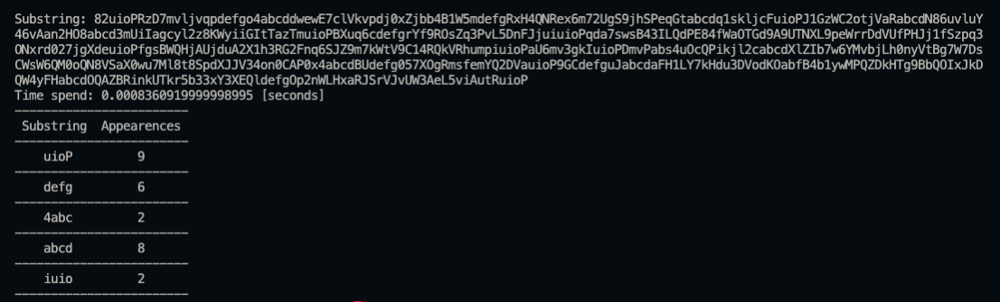

## Index

- [Book Browser](#book-browser)
- [Substring Problem](#substring-problem)
  - [Run script](#run-script)
  - [Example of usage](#example-of-usage)

# Book Browser

# Substring Problem

This script returns the number of appearances of a substring in a string, the result is a dictionary where the key is the substring and the value is the number of ocurriencies, only if this number is greater than one.

## Run script

Python version: `3.9.6`

Script path: `substring-problem/main.py`

Execute script (Windows): `python main.py`

Execute script (MacOS): `python3 main.py`

## Example of usage

the script ask for an input and print a table with the results of the dictionary obtained with the main function `substring_counter(string: str)`

**_Author_**: Andrés Camilo Núñez Garzón